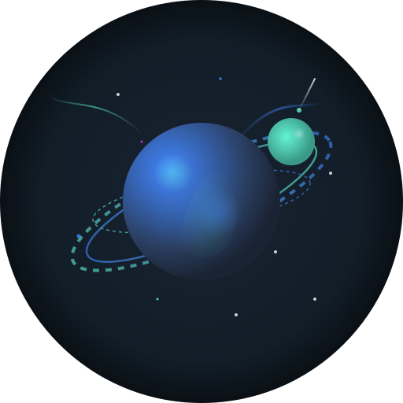
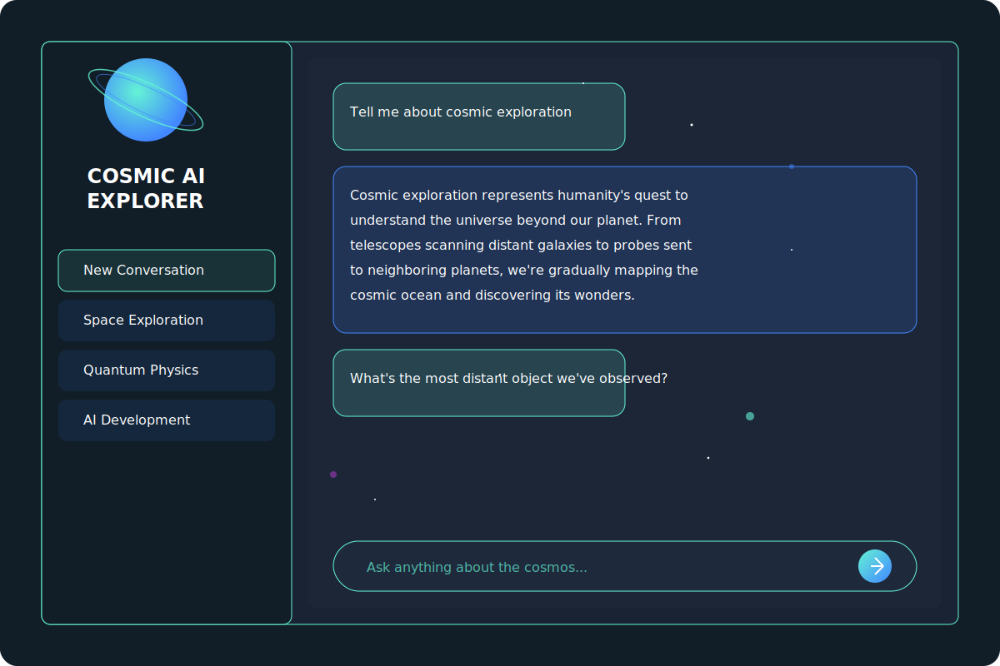

# Cosmic AI Explorer

A beautiful MERN stack chatbot application with a cosmic-themed UI that connects to various AI models including OpenAI, Mistral, and local LLM models.

<div align="center">
  
</div>

## 📷 Screenshots

<div align="center">
  
</div>

## ✨ Features

- **Gorgeous Cosmic UI**: Immersive space-themed interface with animated elements
- **Multi-Model Support**: Choose between different AI models:
  - OpenAI GPT-3.5 Turbo
  - Mistral AI
  - Local LLM via Ollama
  - Fallback mode for when API limits are reached
- **User Authentication**: Secure login and registration system
- **Chat History**: Save and manage conversation history
- **Code Highlighting**: Proper formatting for code snippets
- **Responsive Design**: Works seamlessly on mobile and desktop
- **Dark Mode**: Easy on the eyes with a space-themed dark interface

## 🎨 Cosmic Theme

The application features a meticulously designed cosmic theme:

- **Color Palette**:
  - Primary Turquoise/Teal (`#64f3d5`)
  - Secondary Blue (`#4287ff`)
  - Accent Purple (`#e142ff`)
  - Deep Space Background (`#111d27`, `#1a2333`)

- **Visual Elements**:
  - Planetary rings and orbital animations
  - Cosmic glow effects and gradients
  - Floating orbs representing celestial bodies
  - Star field with twinkling effects
  - Shooting star animations

- **Typography**:
  - Space-themed fonts (Orbitron for headings)
  - Clean, readable text (Roboto Slab for content)

## 🤖 AI Capabilities

The Cosmic AI Explorer interacts with multiple AI backends:

- **Knowledge Base**: Access to vast information on a wide range of topics
- **Code Generation**: Ability to write and explain code in various programming languages
- **Conversational Memory**: AI remembers context from earlier in your conversation
- **Intelligent Fallback**: When API limits are reached, falls back to basic response mode
- **Multi-Model Approach**:
  - OpenAI: Powerful general-purpose AI with broad knowledge
  - Mistral: Alternative AI with comparable capabilities
  - Local LLM: Self-hosted option for privacy and offline use

## 🚀 Tech Stack

- **Frontend**: React, TypeScript, Material-UI
- **Backend**: Node.js, Express
- **Database**: MongoDB
- **Authentication**: JWT
- **AI Integration**: OpenAI API, Mistral AI, Local LLMs

## 🛠️ Installation

### Prerequisites

- Node.js (v14+)
- MongoDB
- API keys for AI providers (optional)

### Setup Steps

1. Clone the repository:
   ```bash
   git clone https://github.com/yourusername/cosmic-ai-explorer.git
   cd cosmic-ai-explorer
   ```

2. Install dependencies for both frontend and backend:
   ```bash
   # Install backend dependencies
   cd backend
   npm install

   # Install frontend dependencies
   cd ../frontend
   npm install
   ```

3. Create a `.env` file in the backend directory with the following variables:
   ```
   PORT=5000
   MONGODB_URL=your_mongodb_connection_string
   JWT_SECRET=your_secret_key
   OPENAI_API_KEY=your_openai_api_key
   LLM_MODEL=openai  # Options: "openai", "mistral", "local-llm", "fallback"
   ```

4. Start the development servers:
   ```bash
   # Start backend server (from backend directory)
   npm run dev

   # Start frontend server (from frontend directory)
   npm start
   ```

5. Access the application at `http://localhost:3000`

## 📱 Usage

1. **Registration/Login**: Create an account or log in to access the chat interface
2. **Start Chatting**: Type your message in the input field and press Enter
3. **Clear History**: Use the "CLEAR HISTORY" button to start a fresh conversation
4. **Model Selection**: Configure your preferred AI model in the backend .env file

## ⚙️ Configuration

### AI Model Selection

To change the AI model being used, modify the `LLM_MODEL` variable in your `.env` file:

```
# Options: "openai", "mistral", "local-llm", "fallback"
LLM_MODEL=openai
```

### API Keys

For OpenAI:
```
OPENAI_API_KEY=your_openai_key
```

For Mistral AI:
```
MISTRAL_API_KEY=your_mistral_key
```

For local LLM (via Ollama):
```
OLLAMA_BASE_URL=http://localhost:11434
```

## 🔒 Security

- JWT authentication with secure token handling
- Passwords are hashed and salted before storage
- Environment variables used for sensitive information
- Rate limiting implemented to prevent abuse
- Input validation on both client and server sides

## 📁 Project Structure

```
cosmic-ai-explorer/
├── backend/                # Node.js and Express backend
│   ├── src/
│   │   ├── controllers/    # Request handlers
│   │   ├── models/         # Database models
│   │   ├── routes/         # API routes
│   │   ├── config/         # Configuration files
│   │   └── index.ts        # Entry point
│   └── package.json
└── frontend/               # React frontend
    ├── public/             # Static assets
    ├── src/
    │   ├── components/     # React components
    │   │   ├── chat/       # Chat components
    │   │   ├── shared/     # Shared UI components
    │   │   └── typer/      # Typing animation
    │   ├── context/        # React context providers
    │   ├── pages/          # Page components
    │   └── index.tsx       # Entry point
    └── package.json
```

## 🌟 Credits

- Designed with a cosmic theme for an immersive AI exploration experience
- SVG illustrations and animations created specifically for this project
- Responsive design optimized for all device sizes

## 📝 Notes

- The application includes a fallback mode for when API limits are reached
- All cosmic-themed SVG illustrations are embedded directly in the code for better performance
- The UI is optimized for both light and dark environments, with dark mode being the default
- Code handling is optimized with syntax highlighting for better readability

## 👥 Contributing

Contributions are welcome! Please feel free to submit a Pull Request.

1. Fork the repository
2. Create your feature branch (`git checkout -b feature/amazing-feature`)
3. Commit your changes (`git commit -m 'Add some amazing feature'`)
4. Push to the branch (`git push origin feature/amazing-feature`)
5. Open a Pull Request

## 📄 License

This project is licensed under the MIT License - see the [LICENSE](LICENSE) file for details.

---

Explore the cosmos of knowledge with Cosmic AI Explorer! 🚀✨ 